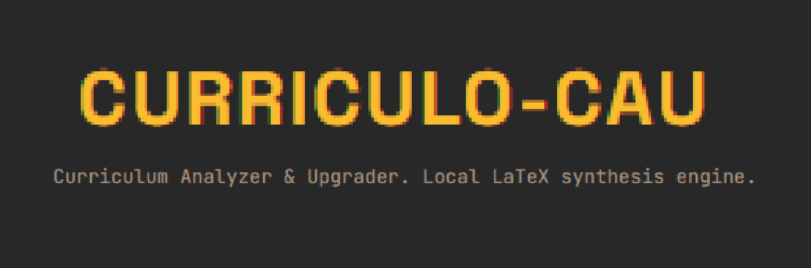
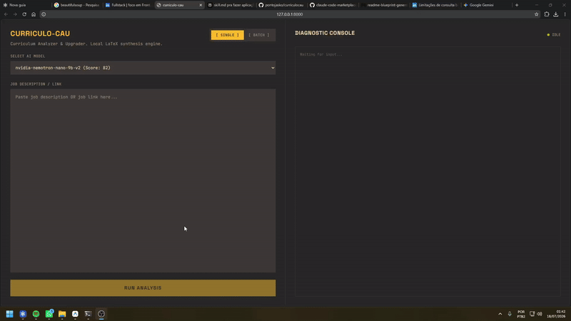

<div align="center">
  

  [](LICENSE)
  [](https://github.com/pontojasko/curriculocau/stargazers)
  [](https://github.com/pontojasko/curriculocau/issues)

  **Have you ever found yourself dreading the tedious process of manually tailoring your resume for every job application?**

  Automatically search, scrape, and optimize your LaTeX resumes using AI and stealth CDP automation.

  [Prerequisites](#prerequisites) • [Installation](#installation) • [Usage](#usage)

  <br />
  
  <br />
  <em>Demo — automatic stealth scraping, batch processing and AI-driven LaTeX generation</em>
</div>

---

## Features

- **Stealth Job Scraping:** Uses Obscura headless browser via CDP (Chrome DevTools Protocol) to scrape job listings (e.g., LinkedIn) while bypassing anti-bot detection without relying on heavy Chromium installations.
- **Batch Processing Mode:** 
  - Search multiple jobs at once using keywords and locations.
  - Built-in **Boolean Search** automatically injected for Remote jobs (`AND (Remoto OR Remote OR "Home Office")`) and localized `Brasil` -> `Brazil` mapping.
  - Processes multiple selected jobs asynchronously with randomized delays (6-12s) to prevent rate limits and IP bans.
- **AI-Powered Tailoring:** Integrates with OpenAI-compatible APIs (like NVIDIA NIM) to restructure your resume context into a targeted, high-match application.
- **LaTeX Compilation:** Generates high-quality PDF resumes using `tectonic` seamlessly in the background.
- **Gruvbox UI:** A premium, retro-terminal Svelte frontend featuring real-time diagnostic consoles, aesthetic physical-style toggle switches, and strict design guidelines.

## Architecture

The project is structured into two main components:
- **Backend (`/backend`)**: Built with Python and FastAPI. Orchestrates the pipeline, manages background tasks for batch processing, and interfaces with the LLM and the Obscura CDP scraper.
- **Frontend (`/frontend-svelte`)**: Built with SvelteKit. Pre-compiled and statically served by FastAPI. Features a reactive UI for both Single Job and Batch Job modes.

## Prerequisites

- **Python 3.10+**
- **Node.js** (Only required if you plan to modify and rebuild the Svelte frontend)
- **Tectonic** (LaTeX engine) - must be available in your system for PDF compilation.

## Installation

1. **Clone the repository:**
   ```bash
   git clone <repository-url>
   cd aicurriculo
   ```

2. **Environment Configuration:**
   Create a `.env` file in the root directory with your API credentials (e.g., NVIDIA NIM or OpenAI keys).

## Usage

The system is designed to be zero-friction. 

### Windows
Double-click `iniciar.bat` or run it via terminal:
```bash
iniciar.bat
```
The script will automatically:
- Create a Python virtual environment (`venv`).
- Install backend dependencies from `requirements.txt`.
- Download and set up the Obscura headless browser in stealth mode.
- Start the FastAPI backend and serve the application on `http://127.0.0.1:8000`.

### Linux/macOS
Run the shell script equivalent:
```bash
./iniciar.sh
```

## Development

If you wish to modify the Gruvbox Svelte frontend:
1. Navigate to the frontend directory:
   ```bash
   cd frontend-svelte
   ```
2. Install Node dependencies and start the dev server:
   ```bash
   npm install
   npm run dev
   ```
3. To package your UI changes for FastAPI to serve:
   ```bash
   npm run build
   ```

## License
Apache License 2.0

## Acknowledgments
- Frontend designed adhering to strict aesthetic and opinionated guidelines (Gruvbox).
- Built with FastAPI, SvelteKit, and Obscura.
